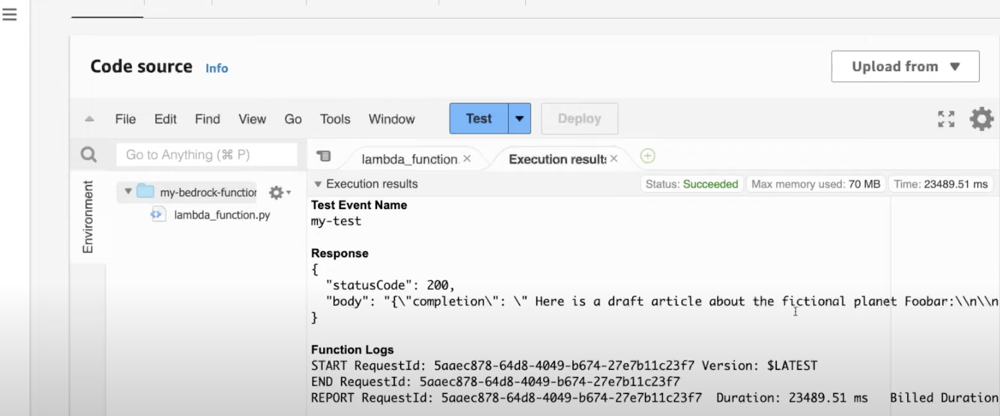

```bash
Note, due to Bedrock is a new service, boto3 need to have a new layer to run python 
# Error: Unknown service: 'bedrock-runtime'.

Steps to create a new lambda layer:
open cloudshell by click button at top 
mkdir ./bedrock-layer 
cd ./bedrock-layer 
mkdir ./python 
pip3 install -t ./python/ boto3
ls -l 
# python//boto*...
zip -r bedrock-layer.zip .   
ls -l 
# bedrock-layer.zip 
# python 
aws lambda publish-layer-version --layer-name bedrock-layer --zip-file fileb://bedrock-layer.zip 

# Console
Layers (at left)
click, copy ARN value 
Open lambda, click layer, 
add layer Specify an ARN, add 
click Test

Response
{
    "statusCode": 200, ...
}

```

