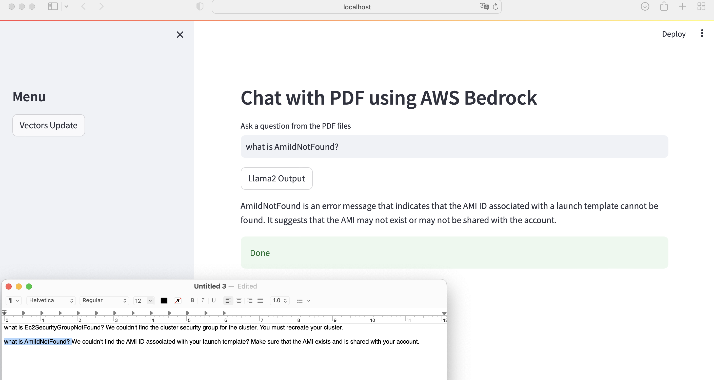
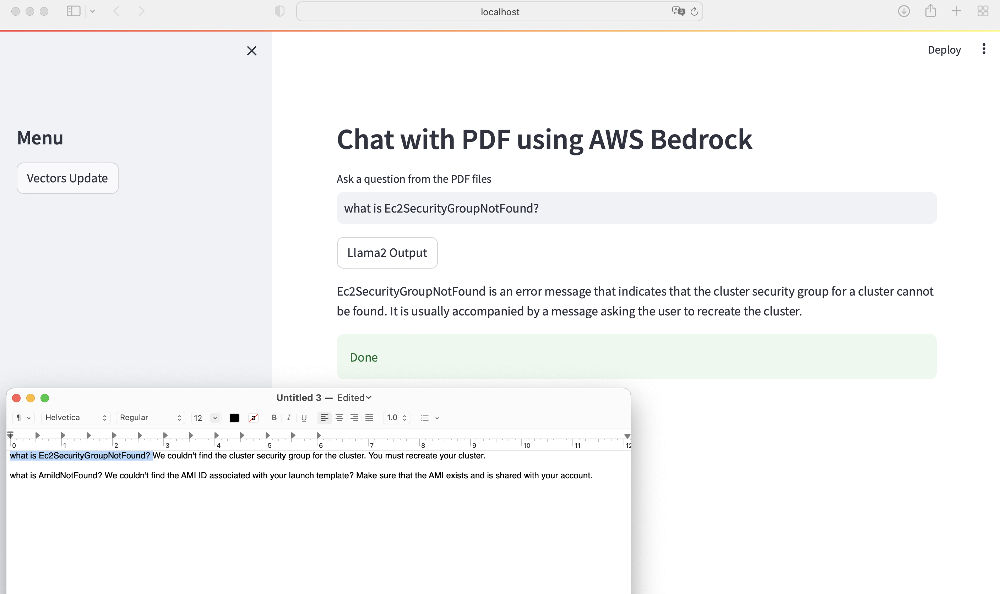

## Example of RAG application using Bedrock and LangChain

## Setup venv

```bash
# pythonb 3.11 is required to work with langchain_community package
# aws configure   # login region: na-east-1

pyenv install 3.11.4

python3.11 -m venv venv
source venv/bin/activate 
pip -r requirements.txt 

streamlit run app.py
```

## Output



