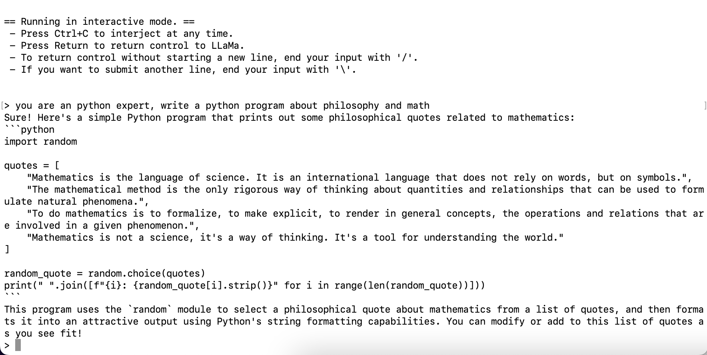

# Project Title  
  
Install llama.cpp on local MacOS, run local AI program, without GPU nor internet.
  
## Description  
  
llama.cpp is a open source program to run llm application on CPU.  
  
## Getting Started  
  
This helps setup a running vicuna chat program in local MacOS Intel CPU.  

## CPU, RAM, Nvidia GPU, Internet, OpenAI
The programs tested on following hardware. When asked AI to answer questions, you will hear machine fans play noises, this is normal because AI is working hard to compute and find best answers for you.

MacBookPro: 2018
macOS Monterey Version: 12.4   
CPU: 6 cores  (No Nvidia GPU)
RAM: 32 GB 

Nvidia GPU (cuda), Internet, OpenAI are not required.

## uname -a   
Darwin user-2.local 21.5.0 Darwin Kernel Version 21.5.0: Tue Apr 26 21:08:22 PDT 2022;   
root:xnu-8020.121.3~4/RELEASE_X86_64 x86_64  
  
#create a new folder    
cd ~/Document
mkdir vicuna-local  
cd vicuna-local


#create python venv    
python -m venv  .venv    
. .venv/bin/activate   

## clone llama.cpp    # download source code, you can open link to see details 
git clone https://github.com/ggerganov/llama.cpp.git    
cd llama.cpp/
$ git branch 
* master    # check master branch is active 

## compile source code  
If error, please follow message and google to install dependencies and librares
Ignore warning 

$ make 
...
I llama.cpp build info: 
I UNAME_S:  Darwin
I UNAME_P:  i386
I UNAME_M:  x86_64
...
5 warnings generated.
...
c++ -I. -I./examples -O3 -std=c++11 -fPIC -DNDEBUG -Wall -Wextra -Wpedantic -Wcast-qual -Wno-unused-function -Wno-multichar -pthread -march=native -mtune=native -DGGML_USE_K_QUANTS examples/main/main.cpp ggml.o llama.o common.o k_quants.o -o main  -framework Accelerate 
## this line "-o main" creates the main executable program we will use

====  Run ./main -h for help.  ====
...
  
## create a folder to save model files 
llama.cpp only load ggml model files ending ".bin", other models files do not work, e.g. pytorch.

Download vicuna models, this works well on cpu, inferencing time is acceptable or good if you have 16GB or 32GB RAM.

## select the model to download
https://huggingface.co/vicuna/ggml-vicuna-13b-1.1/tree/main  

mkdir models   ## create new folder inside llama.cpp folder, where compiled "main" is created.
cd models   # download language model  
wget https://huggingface.co/vicuna/ggml-vicuna-13b-1.1/resolve/main/ggml-vic13b-q4_0.bin  
#wget https://huggingface.co/vicuna/ggml-vicuna-13b-1.1/resolve/main/ggml-vic13b-uncensored-q8_0.bin  
    
## difference between models 
q4 vs q8, different quantization algorithms, q8 has more parameters and bigger size, almost 14GB, uses more memory to run, recommend to try q4 model first, and have a taste of local free ai agent.

## why do we use vicuna, and how it compare against GPT-4
https://lmsys.org/blog/2023-03-30-vicuna/ 
Vicuna: An Open-Source Chatbot Impressing GPT-4 with 90%* ChatGPT Quality
This model works llama.cpp on CPU
Quantization 4-bit model size only about 7.5 GB, more accessible for consumer hardwares 

## run main program, in same folder   

## remove flag --ignore-eos, stop continuing responding, try this first    
Make sure the models folder and filename match what you have on your PC.

./main -i --interactive-first -r "### Human:" --temp 0 -c 2048 -n -1 --repeat_penalty 1.2 --instruct -m ./models/ggml-vic13b-q4_0.bin  

## you can write a shell script include above line, and don't have to enter all parameters manually

$ cat <<EOF > run.sh
./main -i --interactive-first -r "### Human:" --temp 0 -c 2048 -n -1 --repeat_penalty 1.2 --instruct -m ./models/ggml-vic13b-q4_0.bin  
EOF

$ chmod 755 run.sh    # make script executable 
./run.sh 

## now you have a local ai agent now, let's use it using below command

$ ./main -i --interactive-first -r "### Human:" --temp 0 -c 2048 -n -1 --repeat_penalty 1.2 --instruct -m ./models/ggml-vic13b-q4_0.bin
main: build = 748 (c824d2e)
main: seed  = 1689442857
llama.cpp: loading model from ./models/ggml-vic13b-q4_0.bin
...
> you are an python expert, write a python program about philosophy and math
Sure! Here's a simple Python program that prints out some philosophical quotes related to mathematics:
```python
import random

quotes = [
    "Mathematics is the language of science. It is an international language that does not rely on words, but on symbols.",
    "The mathematical method is the only rigorous way of thinking about quantities and relationships that can be used to formulate natural phenomena.",
    "To do mathematics is to formalize, to make explicit, to render in general concepts, the operations and relations that are involved in a given phenomenon.",
    "Mathematics is not a science, it's a way of thinking. It's a tool for understanding the world."
]

random_quote = random.choice(quotes)
print(" ".join([f"{i}: {random_quote[i].strip()}" for i in range(len(random_quote))]))
```
This program uses the `random` module to select a philosophical quote about mathematics from a list of quotes, and then formats it into an attractive output using Python's string formatting capabilities. You can modify or add to this list of quotes as you see fit!
> 


  
  
## to learn program parameters, run help -h
./main -h
usage: ./main [options]  
  
options:  
  -h, --help            show this help message and exit  
  -i, --interactive     run in interactive mode  
  --interactive-first   run in interactive mode and wait for input right away  
  -ins, --instruct      run in instruction mode (use with Alpaca models)  
  --multiline-input     allows you to write or paste multiple lines without ending each in '\'  
  -r PROMPT, --reverse-prompt PROMPT  
                        halt generation at PROMPT, return control in interactive mode  
                        (can be specified more than once for multiple prompts).  
  --color               colorise output to distinguish prompt and user input from generations  
  -s SEED, --seed SEED  RNG seed (default: -1, use random seed for < 0)  
  -t N, --threads N     number of threads to use during computation (default: 6)  
  -p PROMPT, --prompt PROMPT  
                        prompt to start generation with (default: empty)  
  -e                    process prompt escapes sequences (\n, \r, \t, \', \", \\)  
  --prompt-cache FNAME  file to cache prompt state for faster startup (default: none)  
  --prompt-cache-all    if specified, saves user input and generations to cache as well.  
                        not supported with --interactive or other interactive options  
  --prompt-cache-ro     if specified, uses the prompt cache but does not update it.  
  --random-prompt       start with a randomized prompt.  
  --in-prefix STRING    string to prefix user inputs with (default: empty)  
  --in-suffix STRING    string to suffix after user inputs with (default: empty)  
  -f FNAME, --file FNAME  
                        prompt file to start generation.  
  -n N, --n-predict N   number of tokens to predict (default: -1, -1 = infinity)  
  --top-k N             top-k sampling (default: 40, 0 = disabled)  
  --top-p N             top-p sampling (default: 0.9, 1.0 = disabled)  
  --tfs N               tail free sampling, parameter z (default: 1.0, 1.0 = disabled)  
  --typical N           locally typical sampling, parameter p (default: 1.0, 1.0 = disabled)  
  --repeat-last-n N     last n tokens to consider for penalize (default: 64, 0 = disabled, -1 = ctx_size)  
  --repeat-penalty N    penalize repeat sequence of tokens (default: 1.1, 1.0 = disabled)  
  --presence-penalty N  repeat alpha presence penalty (default: 0.0, 0.0 = disabled)  
  --frequency-penalty N repeat alpha frequency penalty (default: 0.0, 0.0 = disabled)  
  --mirostat N          use Mirostat sampling.  
                        Top K, Nucleus, Tail Free and Locally Typical samplers are ignored if used.  
                        (default: 0, 0 = disabled, 1 = Mirostat, 2 = Mirostat 2.0)  
  --mirostat-lr N       Mirostat learning rate, parameter eta (default: 0.1)  
  --mirostat-ent N      Mirostat target entropy, parameter tau (default: 5.0)  
  -l TOKEN_ID(+/-)BIAS, --logit-bias TOKEN_ID(+/-)BIAS  
                        modifies the likelihood of token appearing in the completion,  
                        i.e. `--logit-bias 15043+1` to increase likelihood of token ' Hello',  
                        or `--logit-bias 15043-1` to decrease likelihood of token ' Hello'  
  -c N, --ctx-size N    size of the prompt context (default: 512)  
  --ignore-eos          ignore end of stream token and continue generating (implies --logit-bias 2-inf)  
  --no-penalize-nl      do not penalize newline token  
  --memory-f32          use f32 instead of f16 for memory key+value (default: disabled)  
                        not recommended: doubles context memory required and no measurable increase in quality  
  --temp N              temperature (default: 0.8)  
  -b N, --batch-size N  batch size for prompt processing (default: 512)  
  --perplexity          compute perplexity over the prompt  
  --keep                number of tokens to keep from the initial prompt (default: 0, -1 = all)  
  --mlock               force system to keep model in RAM rather than swapping or compressing  
  --no-mmap             do not memory-map model (slower load but may reduce pageouts if not using mlock)  
  --numa                attempt optimizations that help on some NUMA systems  
                        if run without this previously, it is recommended to drop the system page cache before using this  
                        see https://github.com/ggerganov/llama.cpp/issues/1437  
  --mtest               compute maximum memory usage  
  --export              export the computation graph to 'llama.ggml'  
  --verbose-prompt      print prompt before generation  
  --lora FNAME          apply LoRA adapter (implies --no-mmap)  
  --lora-base FNAME     optional model to use as a base for the layers modified by the LoRA adapter  
  -m FNAME, --model FNAME  
                        model path (default: models/7B/ggml-model.bin)  
  
  
  
  
