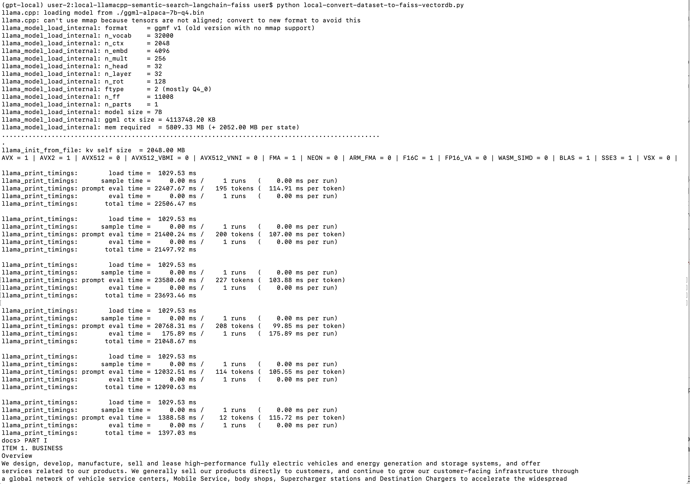
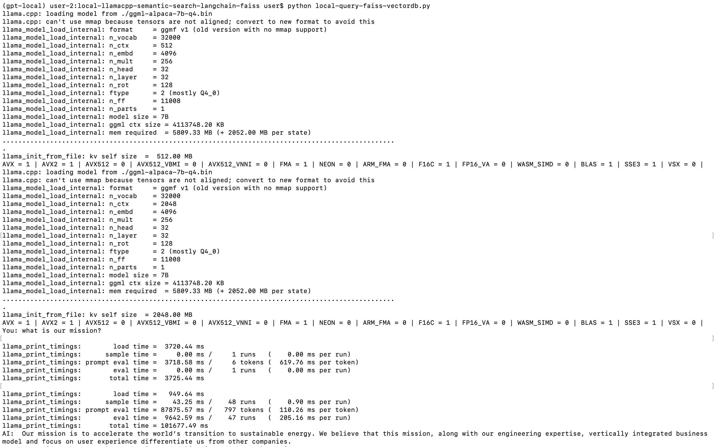
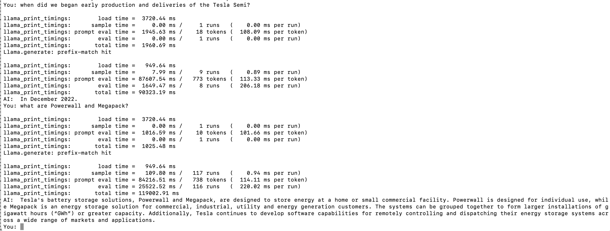

# Project Title          
          
A Local Semantic Search Q&A On Private Dataset Using VectorDB FAISS  
        
## Description          
          
Build local semantic search to query private data set   
Convert dataset to FAISS vector database   
Use vector database to find the best matches to query   
Use LLM and vector db query to find the best answer to question   
    
## Cost and Hardware      
    
Your own PC, minimum 16GB RAM is recommended, 32GB RAM will have better performance      
MacOS is preferred considering it is easy to run "make".      
No GPU, No Internet is required.      
No third party application registration, api keys, or email address is needed.      
    
CPU for ML is slow, also depends on your hardware configurations  
This is just a prototype for learning AI or local development purpose.  
  
## Getting Started          
  
Original source and discussion - A Practical 5-Step Guide to Do Semantic Search on Your Private Data With the Help of LLMs:   
https://hackernoon.com/a-practical-5-step-guide-to-do-semantic-search-on-your-private-data-with-the-help-of-llms  
  
Following python packages:  
langchain (version 0.0.142, pip install langchain==0.0.142)  
FAISS (version faiss-cpu 1.7.4)  
LLM model (ggml-alpaca-7b-q4.bin)  
  
## First we need to check your PC hardware.    
Because AI inferencing uses lot of CPU to process data, enough RAM and CPU helps.    
    
Open a MacOS terminal, run below commands to check os version, RAM, cpu cores.    
    
A README.txt is available, if you think it is easy to copy and paste commands.  
  
# macOS Monterey Version: 12.4           
$uname -a           
Darwin user-2.local 21.5.0 Darwin Kernel Version 21.5.0: Tue Apr 26 21:08:22 PDT 2022;           
root:xnu-8020.121.3~4/RELEASE_X86_64 x86_64          
    
Check memory     
$top    
PhysMem: 32G used    
    
Check number of cpu cores     
$ sysctl -n  hw.ncpu    
12    
    
It is recommended to have a separate python venv or conda env for this activity, to avoid package dependancy conflicts issue.  
  
## Create a conda env if you need to avoid conflicts   
conda create -n myenv python=3.10.11  
conda activate myenv   
  
## Minimum, plus other packages   
pip install langchain==0.0.142  
pip install faiss-cpu=1.7.4  
  
## Download LLM model for embedding, 4GB, small size, good for local dev and testing  
curl -o ./ggml-alpaca-7b-q4.bin -C - https://ipfs.io/ipfs/QmUp1UGeQFDqJKvtjbSYPBiZZKRjLp8shVP9hT8ZB9Ynv1  
  % Total    % Received % Xferd  Average Speed   Time    Time     Time  Current  
                                 Dload  Upload   Total   Spent    Left  Speed  
100 4017M  100 4017M    0     0  20.6M      0  0:03:14  0:03:14 --:--:-- 20.9M  
  
## check model size   
$ ls -ltr  
-rw-r--r--  1 user  staff  4212855021 17 Jul 08:08 ggml-alpaca-7b-q4.bin  
  
## checksum   
$ md5 ggml-alpaca-7b-q4.bin   
MD5 (ggml-alpaca-7b-q4.bin) = 46ac645818cf604afdddcf0f9e5a5d44  
  
  
## Create data set   
The training data set is from 2022 Tesla financial report, Page 4, Part 1  
https://ir.tesla.com/_flysystem/s3/sec/000095017023001409/tsla-20221231-gen.pdf  
  
## Convert dataset to vectordb, the llm model is required   
  
$ python local-convert-dataset-to-faiss-vectordb.py   
llama.cpp: loading model from ./ggml-alpaca-7b-q4.bin  
...  
llama_model_load_internal: mem required  = 5809.33 MB (+ 2052.00 MB per state)  
...  
llama_print_timings:        load time =  1029.53 ms   # -> chunks of dataset   
llama_print_timings:      sample time =     0.00 ms /     1 runs   (    0.00 ms per run)  
llama_print_timings: prompt eval time = 22407.67 ms /   195 tokens (  114.91 ms per token)  
llama_print_timings:        eval time =     0.00 ms /     1 runs   (    0.00 ms per run)  
llama_print_timings:       total time = 22506.47 ms  
  
llama_print_timings:        load time =  1029.53 ms  
llama_print_timings:      sample time =     0.00 ms /     1 runs   (    0.00 ms per run)  
llama_print_timings: prompt eval time = 21400.24 ms /   200 tokens (  107.00 ms per token)  
llama_print_timings:        eval time =     0.00 ms /     1 runs   (    0.00 ms per run)  
llama_print_timings:       total time = 21497.92 ms  
...  
docs> (“PPA”) arrangements. ...  
We continue to improve our installation capability and efficiency, including through collaboration with real estate developers and builders on new homes.  
  
## check vectordb created   
$ ls -ltrR faiss_index/  
total 272  
-rw-r--r--  1 user  staff  81965 17 Jul 21:24 index.faiss  
-rw-r--r--  1 user  staff   5013 17 Jul 21:24 index.pkl  
  
## Query data set using langchain.chains.RetrievalQA  
  
$ python local-query-faiss-vectordb.py   
llama.cpp: loading model from ./ggml-alpaca-7b-q4.bin  
...  
You: what is our mission?  
AI:  Our mission is to accelerate the world’s transition to sustainable energy. We believe that this mission, along with our engineering expertise, vertically integrated business model and focus on user experience differentiate us from other companies.  
## Fact check, above answer is correct, matched training.txt line 10.  
  
You: when did we began early production and deliveries of the Tesla Semi?  
AI:  In December 2022.   
## Fact check, above answer is correct, matched training.txt line 24.  
  
You: what are Powerwall and Megapack?  
AI:  Tesla's battery storage solutions, Powerwall and Megapack, are designed to store energy at a home or small commercial facility. Powerwall is designed for individual use, while Megapack is an energy storage solution for commercial, industrial, utility and energy generation customers. The systems can be grouped together to form larger installations of gigawatt hours (“GWh”) or greater capacity. Additionally, Tesla continues to develop software capabilities for remotely controlling and dispatching their energy storage systems across a wide range of markets and applications.  
## Fact check, above answer is correct, matched training.txt line 29-32.  
  
## All files and structure, model   
Below 2 files are not checked in github  
  
model file ggml-alpaca-7b-q4.bin, download from above url   
./faiss_index, create when run "$ python local-convert-dataset-to-faiss-vectordb.py"  
  
  
$ ls -ltR  .  
total 8259560  
-rw-r--r--  1 user  staff        5753 17 Jul 21:44 README.md  
-rw-r--r--  1 user  staff        1034 17 Jul 20:57 local-query-faiss-vectordb.py  
-rw-r--r--  1 user  staff         868 17 Jul 20:56 local-convert-dataset-to-faiss-vectordb.py  
-rw-r--r--  1 user  staff        4351 17 Jul 20:37 training.txt  
drwxr-xr-x  4 user  staff         128 17 Jul 08:40 faiss_index  
-rw-r--r--  1 user  staff  4212855021 17 Jul 08:08 ggml-alpaca-7b-q4.bin  
  
./faiss_index:  
total 272  
-rw-r--r--  1 user  staff   5013 17 Jul 21:24 index.pkl  
-rw-r--r--  1 user  staff  81965 17 Jul 21:24 index.faiss  
(gpt-local) user-2:local-llamacpp-semantic-search-langchain-faiss user$   
  
## Convert text dataset to vectordb  
    
  
## You query document using llm and vectordb, answer matched dataset   
    
  
## You query document using llm and vectordb, answer matched dataset  
    
  
